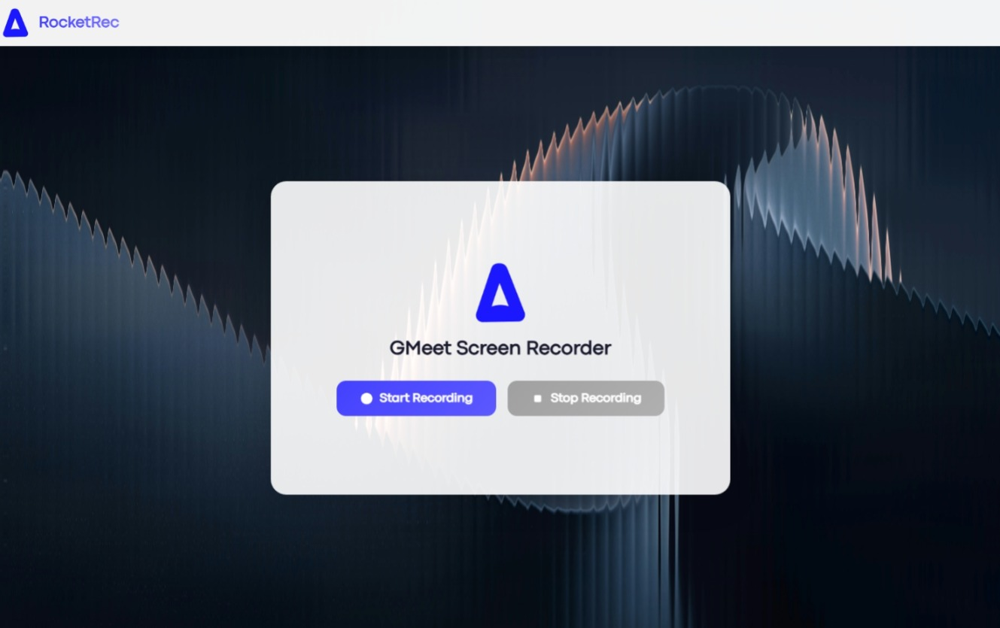

RocketRec is a lightweight screen recorder built specifically for Google Meet. Start and stop recordings with a single click, and automatically download your meetings when you're done. Perfect for saving lectures, interviews, team meetings, and important conversations. RocketRec ensures your privacy as it is completely Client-Side and can even record other tabs, and websites on request

### Screenshot

## Installation

To install and use this extension locally, follow these steps:

1. Download this repository as a `.zip` file and unzip it on your local machine.
2. Open Google Chrome and navigate to `chrome://extensions`.
3. Enable the **Developer mode** toggle, usually found in the top-right corner.
4. Click the **Load unpacked** button.
5. Select the unzipped folder that contains the `manifest.json` file.
6. The RocketRec extension will now appear in your browser's toolbar.

## Usage

1. Click the RocketRec icon in your Chrome toolbar. This will open the recording control panel in a new tab.
2. Click **Start Recording** .
3. A browser prompt will appear. Choose the screen, window, or tab you wish to record. **Important:** If you want to record audio from your computer (e.g., a Google Meet call), be sure to check the "Share tab audio" or "Share system audio" option in the prompt.
4. The recording will begin, and a "Recording" status indicator will appear on the page.
5. When you are finished, navigate back to the RocketRec tab and click **Stop Recording** .
6. Your browser will automatically download the final video as `recording.mp4`.
